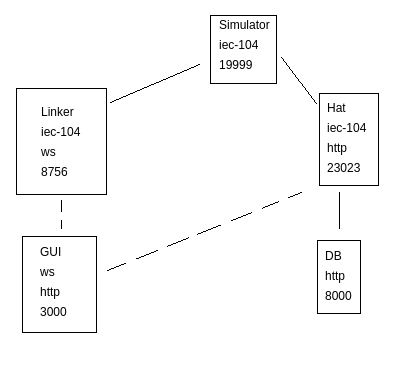

scada-demo
==============
Simple scada project build

This repository uses doit as its build tool, make sure to call ``doit list`` to
check available tasks. 

------
#Documentation (Croatian)

[Opis zadatka](docs/assignment.md).

[Prijedlog koraka razvoja](docs/development_steps.md).

[Opis arhitekture](docs/architecture.md).

[Frontend tutorial](docs/frontend.md).

[Docker workflow](docs/docker.md).

------
#Setup (on ubuntu)

create venv

	python3 -m venv venv

activate venv

	source venv/bin/activate

install requirements

	pip install -r requirements.pip.txt

	try:
		sudo apt-get install $(grep -vE "^\s*#" requirements.ubuntu.txt  | tr "\n" " ")
	except:
		sudo apt-get install binutils-mingw-w64-x86-64 clang doxygen gcc gcc-mingw-w64-x86-64 git graphviz libffi-dev libisoburn-dev libjansson-dev libuv1-dev libyaml-dev nodejs npm openssl pandoc plantuml python3 python3-pip samba socat sqlite3 unixodbc yarn

	try:
		doit

	except:
		doit docs
		doit js_deps
		doit js_view

------
#Starting project

launch simulator

	# from (venv) 
	python3 simulator/main.py

launch backend

	# from (venv) 
	.../playground/run$ ./system.sh
	# login credentials:
	# 	user: user
	# 	password: pass

launch frontend

	.../frontend/ nodemon server.js

------
#Used ports
	
	simulator - iec-104: 19999
	gui - http: 3000
	hat gui - http: 23023
	hat manager - http: 23021

#Scheme

------
#External resources

hat open collection of libraries
    
    https://github.com/hat-open

frontend template

	https://github.com/estevanmaito/windmill-dashboard

websocket package (websockets)

    https://pythonrepo.com/repo/aaugustin-websockets-python-websocket

full screen image
    
    https://www.iconsdb.com/gray-icons/fullscreen-12-icon.html

favicon image

    https://www.favicon-generator.org/search/
------
#todo

	backend revert comm fix
 	todo ad db to gitignore
