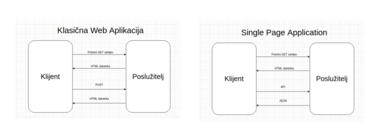

# Frontend

## Single Page Application (SPA).

Općenito gledajući, web aplikacija se sastoji od dvije 'komponente':

- podatci, odnosno sadržaj
- kontrola, odnosno, struktura, stil i ponašanje stranice

U tradicionalnim web aplikacijama te komponente su razdvojene kroz više HTML
stranica, CSS i JS datoteka. Kada korisnik navigira s jedne stranice na drugu
stranicu, čitava stranica se ponovno učitava. Međutim, to nije uvijek potrebno.
Stranice aplikacije većinom dijele komponente UI-a poput: *sidebar , header,
footer, navigation, login, ...*

SPA koristi jednu HTML datoteku za cijelu aplikaciju. Klikom na URL stranice,
ta stranica, s potrebnim CSS i JS dijelovima, se učitava. Nakon toga,
korištenjem stranice, poslužitelj šalje samo relevantne dijelove podataka, bez
potrebe za *refreshom*. Dakle, korisnik može navigirati stranicom i zatražiti
nove podatke bez potrebe za ponovnim učitavanjem. Odnosno, samo se dijelovi
stranice mijenjanju s obzirom na nove podatke.

Razlika u tijeku rada programa (prikazana na slici ispod) je da naknadni upiti
(nakon inicijalnog) ne zahtijevaju slanje cijele HTML stranice, nego se pomoću
API-ja šalju samo relevantni podaci (npr. u JSON formatu).



# Hat renderer

[Hat renderer](https://github.com/hat-open/hat-core/blob/master/src_js/%40hat-core/renderer.js)
je modificirana verzija [snabbdoma](https://github.com/snabbdom/snabbdom).

Renderer enkapsulira state objekt i ponovno iscrtava prikaz ako promijeni
stanje (*state*). Zbog toga je bitno stanje modificirati isključivo funkcijama
koje renderer izlaže, kako bi on znao da je došlo do promjene.

Odnosno, objašnjeno primjerom:
```javascript
    import r from '@hat-core/renderer';
    
    //Funkcija za dohvacanje stanja
    currentState = r.get('putanja', 'do', 'trazenog', 'dijela', 'stanja');
    
    //Funkcija za promjenu stanja
    r.set(['putanja', 'do', 'trazenog', 'dijela', 'stanja'], 'novaVrijednost');

    //

```

Kod samog iscrtavanja, renderer se služi nekim optimizacijama, odnosno,
grupiranje više promjena ako su jedna za drugom,  provjera je li stvarno došlo
do promjene, maksimalni FPS, itd...

Samo iscrtavanje se radi pozivom vt funkcije, koja mora vratiti vt strukturu
prikaza. Nakon toga prilagođava vt snabbdomovim strukturama i poziva
snabbdomov patch algoritam koji prilagodi DOM novoj vt strukturi.

[Više o Virtual DOM(Document Object Model)-u.](https://dev.to/buttercubz/explained-and-created-a-simple-virtual-dom-from-scratch-5765)

## Hat-gui (javascript-python) sučelje.

U dokumentu o arhitekturi, spominje se kako su frontend aplikacije izvedene kao
viewovi. View je buildani JS modul koji ispunjava određeno sučelje - u sebi ima
minimalno exportanu funkciju `vt`, a uz to može imati i `init` te `destroy`.
`vt` sadrži definiciju virtualDOM stabla, dok `init` i `destroy` više služe
svrsi setup-a i teardown-a objekata koje `vt` može koristiti.

Funkcije koje se pozivaju u sklopu viewa imaju pristup globalnoj varijabli
`hat`, koja u sebi sadrži razna polja, no, za potrebe zadatka, najzanimljivije
polje je `conn`, u kojem je objekt koji sadrži referencu na konekciju prema GUI
serveru. Klijent može koristiti tu instancu da šalje poruke na server, koje
primaju i obrađuju adapteri. Ta konekcija zapravo implementira juggler protokol
i, s jedne strane, sinkronizira stanje koje joj dojavljuju sesije adaptera, a s
druge, pruža sučelje JS aplikaciji kojim može slati poruke određenoj sesiji.

Stanja koja se preuzimaju od sesija adaptera nalaze se na putanji `'remote'`
(odnosno, može im se pristupiti s `r.get('remote')`). Na strani adaptera, gdje
se koristi python implementacija jugglera, moguće je notificirati novo stanje
tako da se pozove `juggler_connection.set_local_state({'data': 'xyz'})`.

Što se tiče slanja poruka s frontenda na sesije adaptera, to se radi s pozivom
`hat.conn.send` funkcije, gdje je prvi argument ime adaptera, a drugi
JSON-serijalizabilna poruka. Na strani sesije adaptera, kod python
implementacije jugglera, ta poruka se može primiti pozivom
`await juggler_connection.receive()`.
